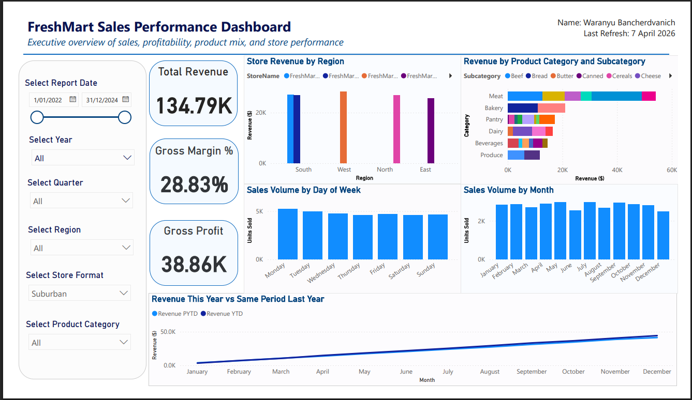

# 🛒 FreshMart Data Warehouse & Sales Dashboard

An end-to-end business intelligence project for **FreshMart**, a fictional Australian supermarket chain. It takes five raw operational CSV files, audits and cleans them, builds a **Kimball star schema** data warehouse, and delivers an executive **sales performance dashboard** on top of it.

Built for **ISYS6013 Business Intelligence and Analytics** at Curtin University by **Waranyu Bancherdvanich**.

---

---

📄 **[Read the full design report (PDF)](docs/freshmart-data-warehouse-report.pdf)** — Kimball four-stage documentation, data quality audit, and ETL steps.

---

## 🧩 The Project

FreshMart's core business activity is selling products to customers. This project models that activity as a **data warehouse**, then builds analytics on top so the business can track sales by product, customer, store, promotion, and time.

It covers the full BI pipeline:
1. **Design** the dimensional model (Kimball method)
2. **Clean** the raw data (Power Query ETL)
3. **Model** it as a star schema in Power BI
4. **Analyse** it through an executive dashboard

---

## 📊 The Dashboard

An executive overview of sales, profitability, product mix, and store performance, with a slicer panel for date, year, quarter, region, store format, and product category.

Key elements:
- **KPI cards** — Total Revenue, Gross Margin %, Gross Profit
- **Store Revenue by Region** — performance across South, West, North, East
- **Revenue by Product Category and Subcategory** — what drives sales
- **Sales Volume by Day of Week and by Month** — demand patterns
- **Revenue This Year vs Same Period Last Year** — YTD vs PYTD time intelligence (DAX)

---

## ⭐ Star Schema (the foundation)

A single **Sales fact table** (17,697 transaction lines) sits at the centre, surrounded by four dimensions plus a generated Date dimension:

| Table | Role | Rows |
|-------|------|------|
| `Sales` | Fact (transaction line grain) | 17,697 |
| `Customer` | Dimension | 514 |
| `Product` | Dimension | 59 |
| `Store` | Dimension | 12 |
| `Promotion` | Dimension | 21 |
| `Date` | Dimension (generated calendar) | — |

The model follows Kimball's four-stage method: **business process** (retail sales), **grain** (one row per product per customer per store per date per promotion, the most detailed level so no analytical option is lost), **dimensions** (Product, Customer, Store, Promotion, Date), and **facts** (QuantitySold, UnitPrice, DiscountAmount, COGS).

**Fact classification:** QuantitySold, DiscountAmount, and COGS are **additive**; UnitPrice is **non-additive** (used in calculations, not summed); there are no semi-additive facts, since this is transaction-level rather than snapshot data.

---

## 🧹 Data Quality Audit & ETL

Each source table was audited and cleaned in **Power Query** before modelling. The real issues found and fixed:

| Table | Problem | Fix |
|-------|---------|-----|
| Customer | 30 duplicate records (same CustomerID, slightly different membership dates) | Removed duplicates by CustomerID |
| Product | Inconsistent category spelling/casing (`dairy`, `Diary`, `bakery`) | Standardised category labels via value replacement |
| Promotion | `N/A` promotion type and blank start/end dates on the no-promotion record | Replaced `N/A` with "No Promotion"; kept blank dates as null to preserve the date type |
| Sales | Mixed date formats in the raw file | Confirmed the column imported correctly as a Date type |
| Sales | 93 rows with `C9999`, a CustomerID matching no customer | Created a `CustomerID_Clean` column mapping `C9999` to "Not Applicable" |
| Store | `SquareMetres` column name not report-friendly | Renamed to `Store Area (sqm)` |

The full audit and the Power Query Applied Steps for each table are in the [design report](docs/freshmart-data-warehouse-report.pdf).

---

## 🛠️ Tools & Techniques

**Power BI** (data model, dashboard, relationships) · **Power Query** (ETL, data cleaning) · **DAX** (KPIs and YTD/PYTD time intelligence) · **Kimball dimensional modelling** (star schema, grain, fact classification) · data quality auditing

---

## 📁 Repository Contents

- `freshmart-data-warehouse.pbix` — the Power BI file (star schema model, Power Query ETL, and the dashboard)
- `docs/freshmart-data-warehouse-report.pdf` — full design report (Kimball documentation, audit, ETL)
- `data/` — the five raw source CSVs (customer, product, promotion, sales, store)
- `images/` — dashboard and model screenshots

---

## 📊 What This Demonstrates

- Building a complete BI solution end to end: design then clean then model then analyse
- Applying a recognised industry method (Kimball) rather than ad-hoc design
- Auditing data quality and making transparent, justified cleaning decisions
- Reasoning about grain and fact additivity, the decisions that make a warehouse reusable
- Turning a clean model into an executive dashboard with DAX time intelligence

---

## 📫 Author

**Waranyu (JO) Bancherdvanich** — [LinkedIn](https://www.linkedin.com/in/waranyu-ban) · [GitHub](https://github.com/jo-bancherdvanich)
