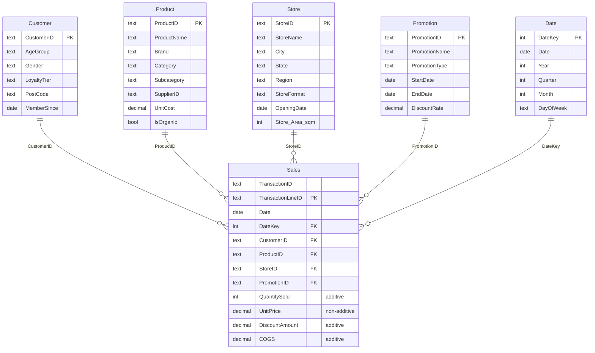

# FreshMart Data Warehouse — Design Report

**Dimensional model, data quality audit, and ETL documentation**
Waranyu Bancherdvanich · ISYS6013 Business Intelligence and Analytics, Curtin University

> Read this version on GitHub, or download the
> [PDF](freshmart-data-warehouse-report.pdf) for the Power BI model view and the
> Power Query Applied Steps screenshots.

---

## Contents

- [1. Kimball four-stage documentation](#1-kimball-four-stage-documentation)
  - [1.1 Business process](#11-stage-1--business-process)
  - [1.2 Grain](#12-stage-2--grain)
  - [1.3 Dimensions](#13-stage-3--dimensions)
  - [1.4 Facts](#14-stage-4--facts)
- [2. Star schema](#2-star-schema)
- [3. Data quality audit](#3-data-quality-audit)
- [4. Power Query applied steps](#4-power-query-applied-steps)
- [Reference list](#reference-list)

---

## 1. Kimball four-stage documentation

### 1.1 Stage 1 — Business process

*Identify the primary business process being modelled and explain why it is the most appropriate choice given the data available.*

The primary business process is **retail sales transactions**, because FreshMart's main activity is selling products to customers. This is the most appropriate choice because Kimball and Ross (2013) state that a business process should be a specific operational activity that produces measurable metrics. The other data — product, store, customer, and promotion — provides descriptive context supporting the sale transaction rather than being a process in its own right.

### 1.2 Stage 2 — Grain

*Precisely declare the grain of the fact table. Explain why you chose this grain over alternatives.*

**The grain: one row represents the sale of a specific product, to a particular customer, at a particular store, on a given date, under a particular promotion.**

The main benefit of a detailed grain is that it keeps all the detail in the data. If requirements change later, or other team members want to analyse it after we leave, they still can. For example, if FreshMart wants to analyse which products are often bought together in the same transaction, that is only possible if the data is held at a detailed grain.

| Option | Description | Chosen |
|---|---|---|
| **Transaction-level grain** | Each individual product sold in a sales transaction is recorded as a separate row | ✅ |
| Daily aggregation | Multiple product sales in the same store on the same day combined into a single row | — |

### 1.3 Stage 3 — Dimensions

*List all dimensions and briefly justify their inclusion.*

According to Kimball and Ross (2013), dimensions describe the business event by providing the "who, what, where, when, why, and how" associated with each measurement.

| Dimension | Why it is included |
|---|---|
| **Product** | Analyse which product categories and subcategories drive the most revenue |
| **Customer** | Analyse customer behaviour and buying patterns — for example, which customer groups spend more |
| **Store** | Compare sales performance across stores and regions |
| **Promotion** | Analyse the effectiveness of promotions on sales performance |
| **Date** | Enable time-based analysis such as YTD, PYTD, and YoY % |

The Date dimension was generated separately rather than relying on the date column in the Sales table. The Sales date only records when a transaction happened; a full calendar dimension is needed to support year-to-date and prior-year analysis.

### 1.4 Stage 4 — Facts

*Identify all additive, semi-additive, and non-additive facts and classify them accordingly.*

| Fact | Classification | Reasoning |
|---|---|---|
| `QuantitySold` | **Additive** | Can be summed meaningfully across all dimensions |
| `DiscountAmount` | **Additive** | Can be summed meaningfully across all dimensions |
| `COGS` | **Additive** | Can be summed meaningfully across all dimensions |
| `UnitPrice` | **Non-additive** | Cannot be summed directly; must be used within calculations |

There are **no semi-additive facts** in this model, because the dataset is transaction-level sales data rather than balance or snapshot data.

---

## 2. Star schema

A single `Sales` fact table sits at the centre, surrounded by four dimensions plus a generated Date dimension.

| Table | Role | Rows |
|---|---|---|
| `Sales` | Fact (transaction line grain) | 17,697 |
| `Customer` | Dimension | 500 (515 raw, 15 duplicates removed) |
| `Product` | Dimension | 60 |
| `Store` | Dimension | 12 |
| `Promotion` | Dimension | 21 |
| `Date` | Dimension (generated calendar) | — |

The full-size Power BI model view is in the [PDF report](freshmart-data-warehouse-report.pdf).

---

## 3. Data quality audit

Each source table was audited and cleaned in Power Query before modelling.

| Table | Column | Problem | Rows | Remediation |
|---|---|---|---|---|
| Customer | `CustomerID`, `MemberSince` | Duplicate customer records with the same `CustomerID` but slightly different membership dates | 30 | Removed duplicate rows based on `CustomerID` in Power Query |
| Product | `Category` | Inconsistent spelling and capitalisation — `dairy`, `Diary`, `bakery` | 8 | Standardised category labels using a cleaned column and value replacement |
| Promotion | `PromotionType`, `StartDate`, `EndDate` | `N/A` used as the promotion type on the no-promotion record; blank start and end dates | 1 | Replaced `N/A` with "No Promotion" to be business-friendly. Blank dates kept as null — entering text would have changed the column to a text data type |
| Sales | `Date` | Mixed date formats in the raw file when viewed in Notepad | — | Power BI resolves the mixed formats on import; the action was confirming the column type was set correctly as Date |
| Sales | `CustomerID` | The value `C9999` matched no record in the Customer table | 93 | Created a `CustomerID_Clean` column mapping `C9999` to "Not Applicable", for clearer handling of unmatched customer records |
| Store | `SquareMetres` | Column name not report-friendly | — | Renamed to `Store Area (sqm)` |

*Source: created by the author from the FreshMart source tables provided in the assignment.*

**A note on the duplicate count.** 15 distinct `CustomerID` values appear twice each, so **30 rows are involved** in the duplication and **15 rows are removed** by deduplication — taking the Customer dimension from 515 raw rows to 500.

---

## 4. Power Query applied steps

Every transformation above was applied as a Power Query step on the relevant table. The Applied Steps panel for each of the five source tables — Customer, Product, Sales, Store, and Promotion — is captured as screenshots in the appendix of the [PDF report](freshmart-data-warehouse-report.pdf); those are images inside the PDF and are not reproduced here.

---

## Reference list

Kimball, R., & Ross, M. (2013). *The Data Warehouse Toolkit: The Definitive Guide to Dimensional Modeling* (3rd ed.). John Wiley & Sons.
